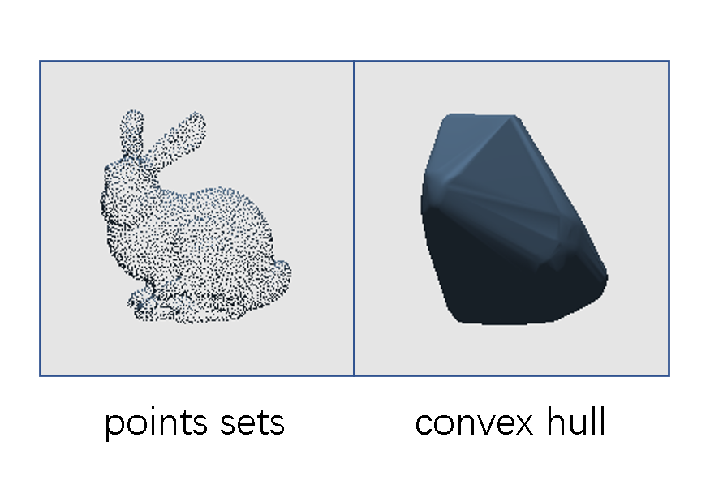

## 3D Convex Hull Problems

​	In this project, we complete two tasks. First, we implement a 3D convex hull algorithm with visualization. Second, we implement collision detection for two convex hulls of two 3D point sets. Also, 2nd task is based on the completion of 1st task. 

​	In 1st task, I achieve 3D convex hull construction by 3D version of incremental algorithm, and display the visualization based on OpenGL. By the way, all the frameworks are set up by myself, it takes me about 3 days to complete the frameworks. 

​	In 2nd task, I achieve 3D convex hulls collision detection by 3D version of separating axis theorem algorithm, display runtime analysis information and speed up the algorithm by using OpenMP. I believe that I don’t make it perfectly since I don’t use matrix operation to make use of GPU sources which limits the performance of this algorithm with many dots products.

## run

```bash
cd build
# calculate the convex hull
main.exe 0
# 3D convex hull collision detection
main.exe 1
main.exe 2
main.exe 3
main.exe 4
main.exe 5
main.exe 6
main.exe 7
```

​	Please press `Enter` button on your keyboard to 1.get the convex hull or 2.make collision detection.

## Result

